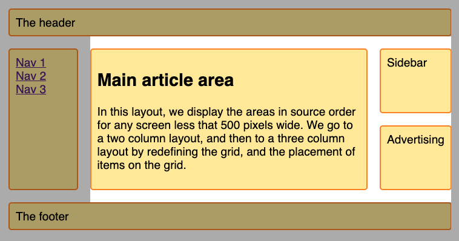

# CSS Grid Kata

## Ziel vom Coding Kata
CSS Grid etwas genauer anschauen

## Aufgaben
1. Erstelle dieses Layout mithilfe ein Grids wobei der helle Bereich ein Bild im Hintergrund (kein background-image) ist.
   